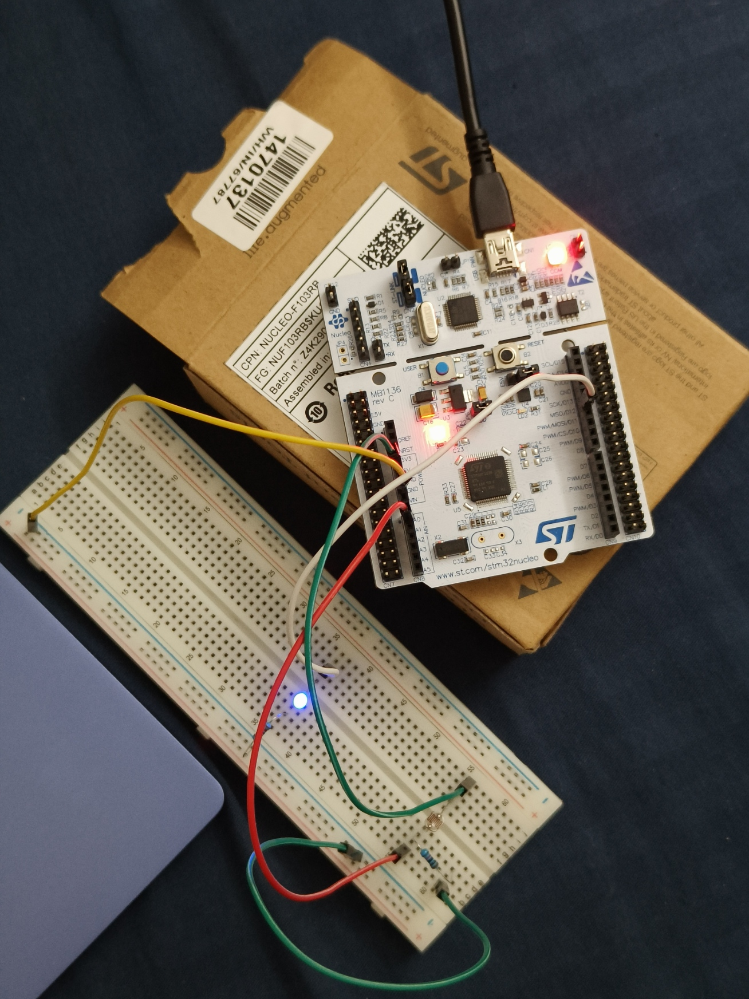

# Adaptive Illumination Controller  
A dual-mode ambient-light-responsive LED controller using STM32.

---

## 📌 Overview
The **Adaptive Illumination Controller** is a smart lighting system that adjusts LED behavior based on ambient light using an **LDR (Photoresistor)**.

The system features two operational modes, selectable using a **hardware push-button interrupt (EXTI)**:

### **Mode 1 – Digital Light Control**
- LED turns **ON** in low light  
- LED turns **OFF** in bright light  
- Thresholds:
  - **< 1200** ADC → LED ON  
  - **> 2800** ADC → LED OFF  

### **Mode 2 – PWM Dimming Control**
- LED brightness adjusts with light levels  
- Dark → **100% duty**  
- Bright → **0% duty**  
- Intermediate values → **linearly interpolated**

Real-time system data is printed via **UART2** and viewable in Putty/TeraTerm.

---

## ✨ Features
- 📡 **Ambient Light Detection** (LDR + ADC)
- 🔄 **Mode Switching via EXTI Button**
- 💡 **PWM Dimming (TIM3_CH1)**
- 🔌 **UART Monitoring (115200 baud)**
- 🔁 **Runtime GPIO/PWM switching on PA6**
- 🌙 **Adaptive night-light behavior**
- 🔧 **Clean, modular code structure**

---

## 🧩 Hardware Requirements
- **STM32 Nucleo-F103RB**
- LDR (photoresistor)
- 10 kΩ resistor (voltage divider)
- Push button (momentary)
- LED + 330 Ω resistor
- Jumper wires  
- Breadboard  

---

## 🔌 Pin Mapping

| Function | Component | STM32 Pin |
|---------|-----------|-----------|
| LDR ADC Input | LDR Voltage Divider | **PA0 (ADC1_IN0)** |
| UART TX | USB Serial Debug | **PA2 (USART2_TX)** |
| UART RX | USB Serial Debug | **PA3 (USART2_RX)** |
| LED Output | LED (PWM + GPIO) | **PA6 (TIM3_CH1)** |
| Mode Button | Push Button (EXTI) | **PC13 (GPIO_EXTI13)** |

---

## 🛠 CubeMX Configuration Summary

### **ADC1**
- Channel: **IN0 (PA0)**
- Resolution: 12-bit  
- Single Conversion Mode  
- Sampling Time: 55.5 cycles  

### **USART2**
- Baud: **115200**
- TX: PA2  
- RX: PA3  

### **PWM (TIM3_CH1)**
- Timer: TIM3  
- Channel: CH1  
- Pin: PA6  
- Prescaler: 71  
- ARR: 100 → (1 kHz / 100-step duty)  

### **EXTI Button**
- Pin: **PC13**
- Trigger: **Falling edge**
- Pull-up: **Enabled**
- NVIC: EXTI line [15:10] enabled  

---

## ▶ Building & Flashing
1. Open the project in **STM32CubeIDE**  
2. Build → Run  
3. Connect Nucleo USB  
4. Open Putty @ 115200 baud  
5. Press the button to switch modes  

---

## 📸 Hardware Setup

---

## 📝 License
This project is licensed under the **MIT License** — feel free to use it in your own projects.

---

## 💬 Author
**Nithin Reddy**  
Adaptive Embedded Systems Developer  
Hyderabad, India  

---
